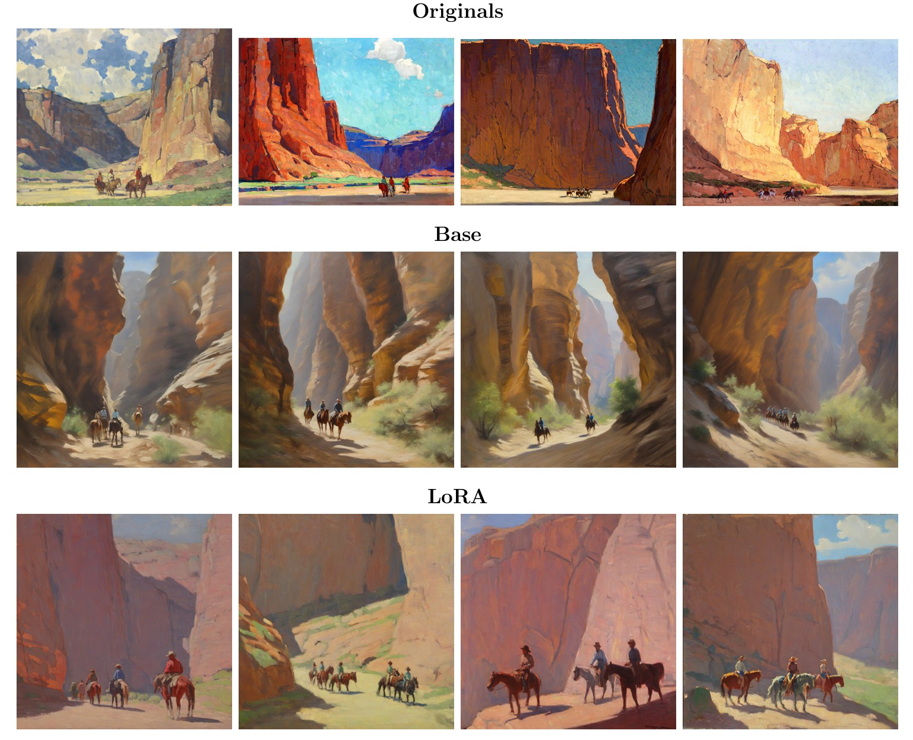

# ArtistDiffusionModel

Style-adaptive image generation using latent diffusion and LoRA fine-tuning.

## Project summary
This project fine-tunes an **SDXL LoRA** to reproduce the style of the painter **Edgar Alwin Payne** using a small curated dataset.

- **Dataset:** 54 paintings by Edgar Alwin Payne
- **Captioning:** captions written manually by me
- **Style token used in captions/prompts:** `<EdgarAPayne>`
- **Phrase always included:** `oil painting landscape`
- **Training parameters:** all parameters are defined directly in the code (see the run/training scripts in this repository)

---

## Environment setup (Conda)

This project was developed and run inside a Conda environment.

```bash
# create the environment
conda env create -f environment.yml

# activate the environment (replace with your env name)
conda activate <ENV_NAME>

# if you are unsure about the env name:
conda env list
```
---

## Usage

Run the training script you used for your final model, e.g.:
```bash
python runTraining.py
```
There you find all the parameters used for training.

### Prompt format
During training, prompts always included:
- the style token: `<EdgarAPayne>`
- the phrase: `oil painting landscape`

Example prompt:
```text
<EdgarAPayne> oil painting landscape, mountains, dramatic light
```

---

## Example result



---

## Image credits and license (left to right)

All referenced source images are hosted on **Wikimedia Commons**. Their file pages state **Public Domain (PD-Art / PDM 1.0)**. Images used in this work were **cropped** (see notes per item).

1. **Indians Riding through the Canyon de Chelly** — Edgar Alwin Payne  
   Source: [Wikimedia Commons file page](https://commons.wikimedia.org/wiki/File:Edgar_Payne_Indians_Riding_through_the_Canyon_de_Chelly.jpg)  
   Accessed: 2026-02-01  
   License note: Public Domain (PD-Art / PDM 1.0). Image used in this work was cropped.

2. **Riders in Canyon de Chelly** — Edgar Alwin Payne  
   Source: [Wikimedia Commons file page](https://commons.wikimedia.org/wiki/File:Edgar_Payne_Riders_in_Canyon_de_Chelly.jpg)  
   Accessed: 2026-02-01  
   License note: Public Domain (PD-Art / PDM 1.0). Image used in this work was cropped.

3. **Sunset, Canyon de Chelly** — Edgar Alwin Payne  
   Source: [Wikimedia Commons file page](https://commons.wikimedia.org/wiki/File:Edgar_Payne_Sunset,_Canyon_de_Chelly.jpg)  
   Accessed: 2026-02-01  
   License note: Public Domain (PD-Art / PDM 1.0). Image used in this work was cropped.

4. **Turn in Canyon de Chelly** — Edgar Alwin Payne  
   Source: [Wikimedia Commons file page](https://commons.wikimedia.org/wiki/File:Edgar_Payne_Turn_in_Canyon_de_Chelly.jpg)  
   Accessed: 2026-02-01  
   License note: Public Domain (PD-Art / PDM 1.0). Image used in this work was cropped.

---


